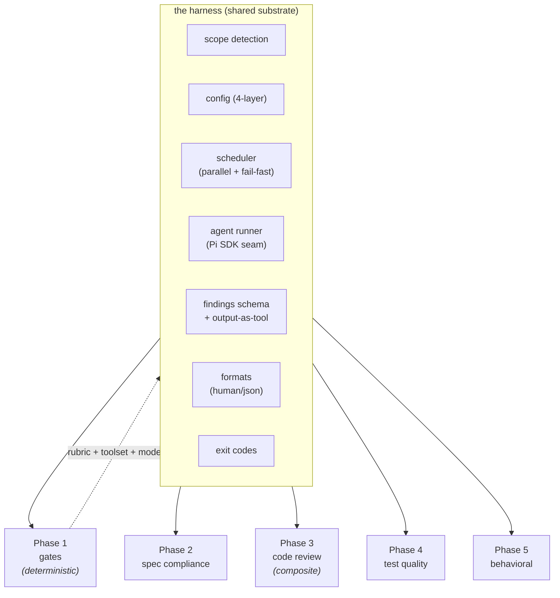
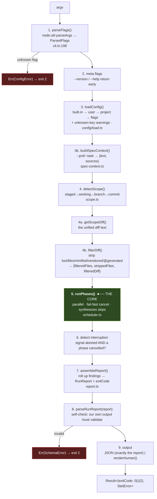
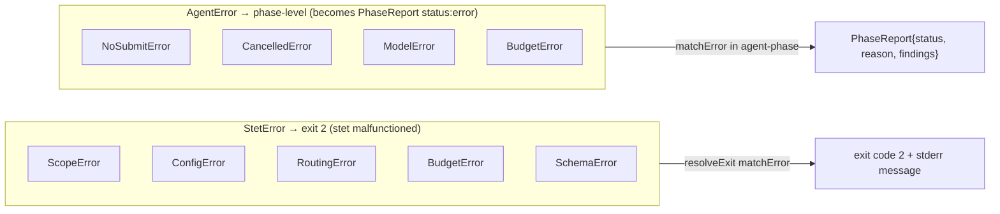
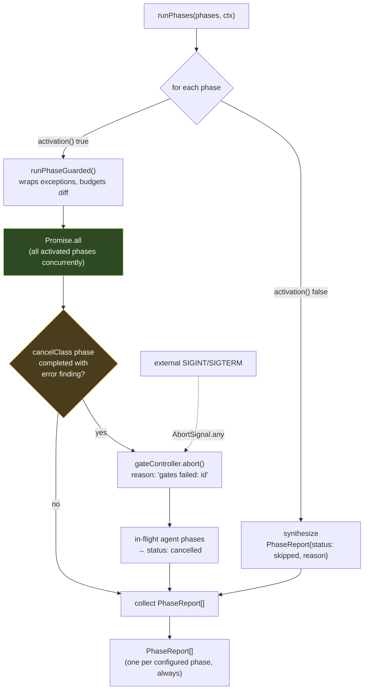
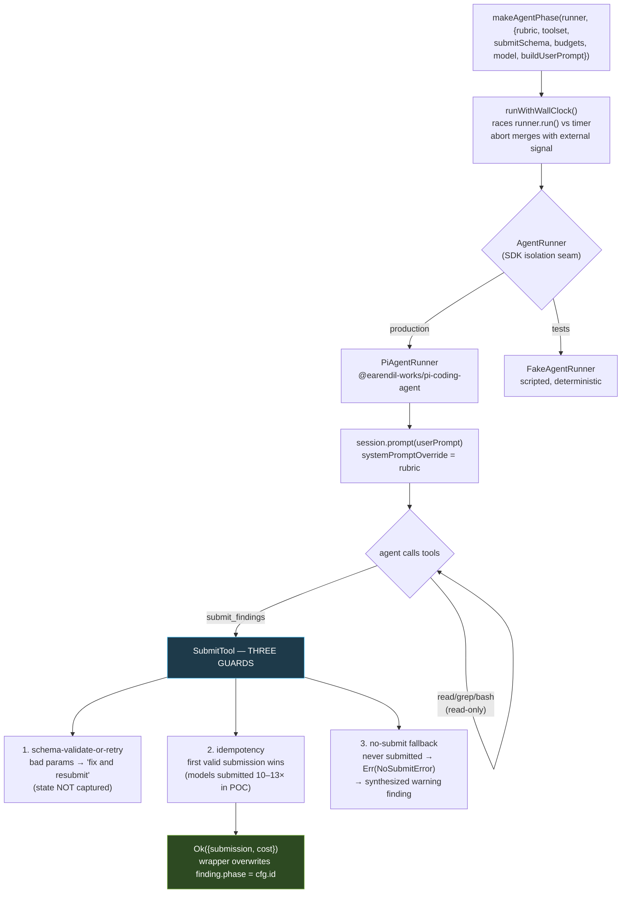
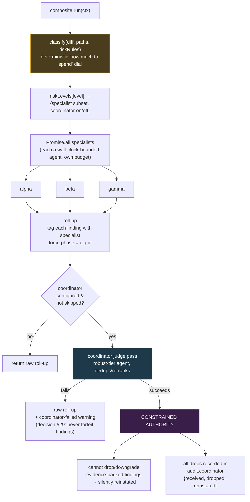
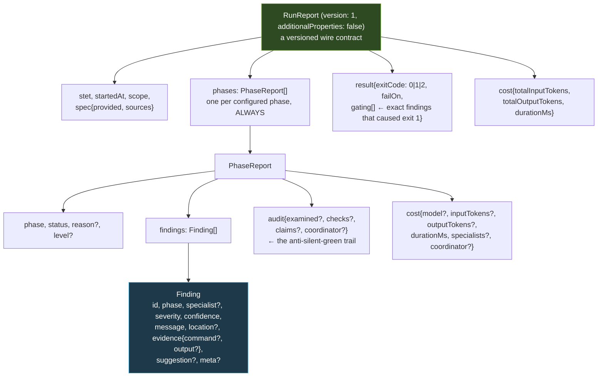
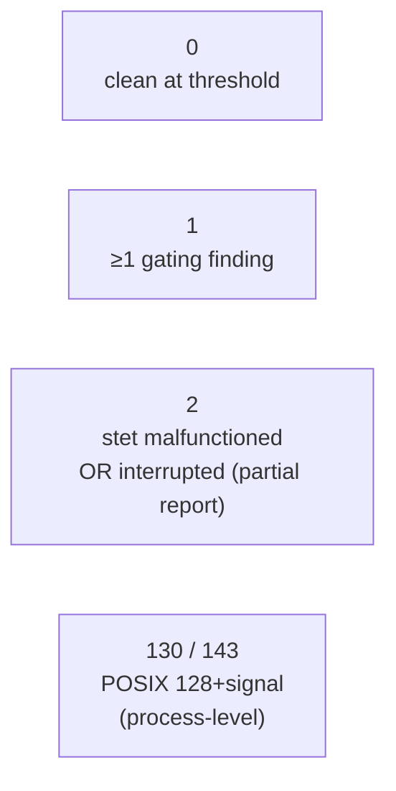
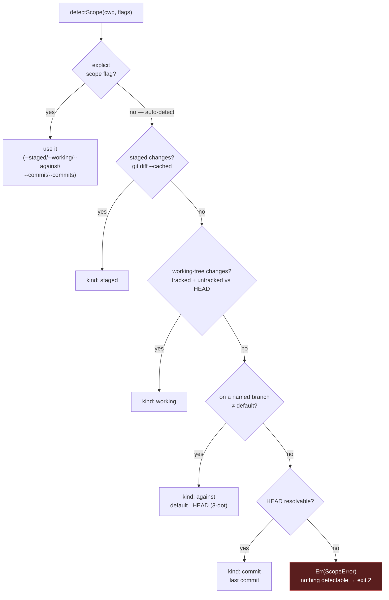
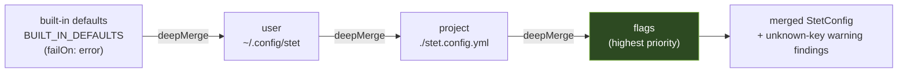

# stet — Code Architecture & Design Primer

> **Status:** living orientation doc. Reflects the codebase as of the M1–M8 harness build
> (PR #53). Read this before extending the harness. For the *product* vision see
> `docs/better-planning/product/stet-prd.md`; for build traps see `docs/engineering-notes.md`;
> for vocabulary see `GLOSSARY.md`.

---

## 1. The one-sentence mental model

> **stet is a harness that runs N independent "phases" in parallel over a git diff, collects
> their findings into one versioned report, and turns that report into an exit code — while
> never throwing, never writing, and never letting a green result mean "nothing was checked."**

Everything else is a consequence of that sentence. The core idea: the **harness** (the shared
substrate) is the whole product so far, and each of the five validation dimensions is *just a
configuration* of it. A phase contributes only three things: **a rubric (system prompt) + a
toolset + a model**. Adding a sixth phase is one new file + one `registerPhase()` call — no
harness code changes.



---

## 2. The pipeline — one run, end to end

This is `main()` in `src/cli.ts:308`. Read it as nine sequential stages; the parallelism is
*inside* stage 5.



The process boundary (`cli.ts:540`) wraps this in `runWithSignals`, calls `resolveExit` (the
single `Err`→exit-2 `matchError`, `cli.ts:100`), runs `teardownServices()`, and sets
`process.exitCode`.

---

## 3. The three load-bearing design decisions

Everything in the codebase is downstream of these. Understand these three and the rest reads
naturally.

### A. `better-result` — typed errors, no throws across boundaries

Every fallible function returns `Result<T, E>`. There is **exactly one** throw→exit boundary:
`resolveExit` in `cli.ts:100`, which does an exhaustive `matchError` over the `StetError` union
(`ScopeError | ConfigError | RoutingError | BudgetError | SchemaError`, all in `src/errors.ts`).
Adding a new error variant is a **compile error** until that match handles it. Errors are
first-class test targets — assert `result.isErr()` and the tag, never `expect().toThrow()`.

There's a deliberate split:



### B. The infallible phase boundary

`PhaseConfiguration.run()` **never throws and never rejects** (`phases/types.ts:72`). Any
internal failure is converted to a `PhaseReport{ status: "error", reason }`. This is what makes
`Promise.all` over phases safe — one phase blowing up can't take down the run. A phase is a pure
data value (no class, no inheritance):

```ts
interface PhaseConfiguration {
  id: PhaseId;                          // open kebab-case string, not a closed enum (decision #28)
  kind: "deterministic" | "agent";
  activation: (ctx) => boolean;         // pure predicate: should I run for this scope?
  run: (ctx) => Promise<PhaseReport>;   // INFALLIBLE — never throws, never rejects
  toolset?: string[];                   // agent phases expose their allowlist (auditable)
  cancelClass?: boolean;                // my failure cancels in-flight agents
  consumesDiff?: boolean;               // I inject the diff → respect the budget
}
```

### C. Mutation-free by construction

There is no `--fix`, anywhere, by design. The invariant is enforced at the **call boundary, not
at runtime**: a phase's `toolset` is a string array that simply never contains write tools, and
it's exposed on the registered phase so it's *auditable*. The agent runner replaces the SDK's
unrestricted `bash` with a limited custom one (`pi-runner.ts`). The one honest gap: `bash`
remains a residual write surface until Phase 5 builds a sandbox (PRD decision #34).

---

## 4. The scheduler — where "parallel by default" lives

`runPhases(phases, ctx)` in `scheduler.ts` is the heart.



Key behaviours (PRD §3.4.2):

- **All activated phases launch concurrently** via `Promise.all` → wall-clock ≈ slowest phase,
  not the sum.
- **Skips are synthesized**: a phase whose `activation()` returns false becomes a `skipped`
  report with a named reason. Every configured phase appears exactly once — a green report can
  never silently mean "this phase didn't run."
- **Fail-fast cancellation**: when a `cancelClass: true` phase (the gates) *completes with an
  error finding*, the internal `gateController` aborts; in-flight agents get the signal and
  return `cancelled`. A gate *timeout* (`status:"error"`) is **report-only** — only a gate that
  actually ran and failed proves the code is broken.
- **Signal merging**: external SIGINT/SIGTERM and the internal gate controller combine with
  `AbortSignal.any([...])`.
- **Diff budgeting**: `budgetDiff()` is computed *once* per run; only phases with
  `consumesDiff: true` receive the trimmed diff. The risk classifier deliberately does *not* set
  it — it needs the full diff so a risk-relevant file in the over-budget tail can't escape.
  Excluded files surface as a `<phase>.partial-coverage` warning — never a silent truncation.

---

## 5. The agent substrate — "output-as-tool"

The most novel mechanism. An agent phase finishes **only** by calling the `submit_findings`
tool — there is no other way to produce a result.



Two non-obvious but important details:

- **Provenance is harness-controlled**: after the agent submits, the wrapper *overwrites* each
  finding's `phase` field with the real phase id (`agent-phase.ts:339`). A model cannot fabricate
  a finding attributed to a phase that didn't run.
- **Budgets are two-layered** (`budgets.ts`): the *wrapper* owns wall-clock; the *runner* owns
  bash timeout + output cap. The bash runner uses `detached: true` process groups so one SIGKILL
  kills the shell *and* its children, with a 100ms grace period for background children holding
  the stdout pipe open (a real hang bug — see `engineering-notes.md`).

### Model routing (`src/routing/`)

Configuration, not code. Built-in defaults are **capability tiers** (`robust`, `fast`) →
`TIER_PREFERENCES` ordered lists → resolved at runtime against providers you actually have
credentials for. `runWithFallback` tries models in order (advancing on retryable errors),
`preflightAll` validates every phase can resolve *before* any launch, and `checkQualification`
emits a warning for any model not validated on the eval suite for the current rubric version.

---

## 6. Composite phases — the specialist panel

The richest phase shape (`composite.ts`), used by code review. One phase fans out to **N
specialists** in parallel, then optionally runs a **coordinator (judge pass)**.



The coordinator is *machinery* the harness owns; the actual review rubric is the (not-yet-built)
code-review feature's. The constraint design is the key insight: an LLM judge may *improve* the
ranking but is structurally forbidden from *hiding* a deterministic or evidence-backed problem.

---

## 7. The findings/report schema — the contract spine

Everything is TypeBox (`src/schema/`), using the same-name value+type merge pattern
(`export const Finding = Type.Object(...)` + `export type Finding = Static<typeof Finding>`), so
code reads like the wire contract.



The **gating rule** is deterministic and lives in `exit-codes.ts`: a finding gates exit 1 iff
`severityAtLeast(severity, failOn)` **AND** `confidence === "high"`. So low-confidence AI
opinions never break your build. Severity ordering has a single source of truth — `SEVERITY_RANK`
+ `severityAtLeast` in `schema/finding.ts`.

### Exit-code contract



The report's `result.exitCode` stays in the `0|1|2` domain even when the *process* exits
130/143 — a JSON consumer distinguishes "clean" from "interrupted" via `exitCode:2` + cancelled
phases.

---

## 8. Scope & diff acquisition — the input layer

`scope.ts` is the zero-config front door. The auto-detection ladder:



Subtle correctness work lives here: root-commit handling (no `^1` parent), untracked files via
`git diff --no-index` (mutation-free — never stages), three-dot merge-base form for branch
comparison, and a 50MB buffer for monorepos. `diff-sections.ts` then parses the unified diff
robustly (handles `noprefix`, mnemonic prefixes, quoted paths, combined diffs) and is a *total
function* — it never fails, just skips unparseable sections.

---

## 9. Config — four layers, deep-merged

`loadConfig()` merges leaf-by-leaf (`merge.ts`):



Two things worth knowing: missing files are *no-ops* (zero-config is valid), and unknown keys
become **warning findings**, not errors (forward compat) — surfaced via a synthetic `harness`
phase in the report. The merge has explicit prototype-pollution defense
(`__proto__`/`constructor`/`prototype` keys dropped) because YAML parsers emit `__proto__` as an
own key.

---

## 10. Where the project actually is

To be precise about state (the planning docs say "greenfield," but a lot is built):

- ✅ **The harness is complete and exhaustively tested** — 32 test files, M1–M8: scope, config,
  scheduler, agent runner + Pi SDK integration, composite/coordinator, risk classifier, routing,
  spec-context, diff-filtering, output formats, exit codes, signal/teardown.
- 🚧 **The five real phases are still stubs.** `defaultPhases = [stubDet]`
  (`phases/index.ts`), plus a `stub-agent` wired in the CLI entry. The real
  `gates`/`spec`/`review`/`test-quality`/`behavioral` rubrics are each their own feature PRD, not
  yet implemented. The stubs (`stub-det` runs a shell command, `stub-agent` finds TODOs,
  `stub-composite` has alpha/beta/gamma specialists) are the *steel thread* that proves the
  machinery end-to-end.

**The chassis is finished and proven; the engines are the next build.** The first real one is
`deterministic-gates` (Phase 1) — deterministic (no LLM, lowest risk), and `stub-det` already
shows the exact shape.

---

## 11. How to read the code yourself

Trace one thread and it touches every subsystem above:

```
src/cli.ts:308  main()
   → scheduler.ts   runPhases()
       → phases/stub-det.ts   run()
   → report.ts   assembleReport()
   → output/human.ts   renderHuman()
```

| If you want to understand… | Start here |
|---|---|
| The whole run | `src/cli.ts` `main()` |
| Parallelism + cancellation | `src/scheduler.ts` `runPhases()` |
| The phase contract | `src/phases/types.ts` |
| How an agent phase works | `src/phases/agent-phase.ts` + `src/agent/runner.ts` |
| Output-as-tool guards | `src/agent/submit-tool.ts` |
| The specialist panel + judge | `src/phases/composite.ts` + `coordinator.ts` |
| The wire contract | `src/schema/report.ts` + `src/schema/finding.ts` |
| Exit-code gating | `src/exit-codes.ts` |
| Scope auto-detection | `src/scope.ts` |
| Error taxonomy | `src/errors.ts` |
</content>
</invoke>
